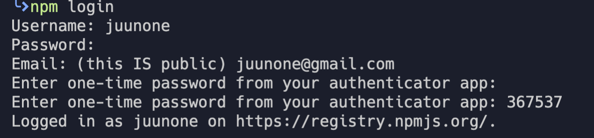
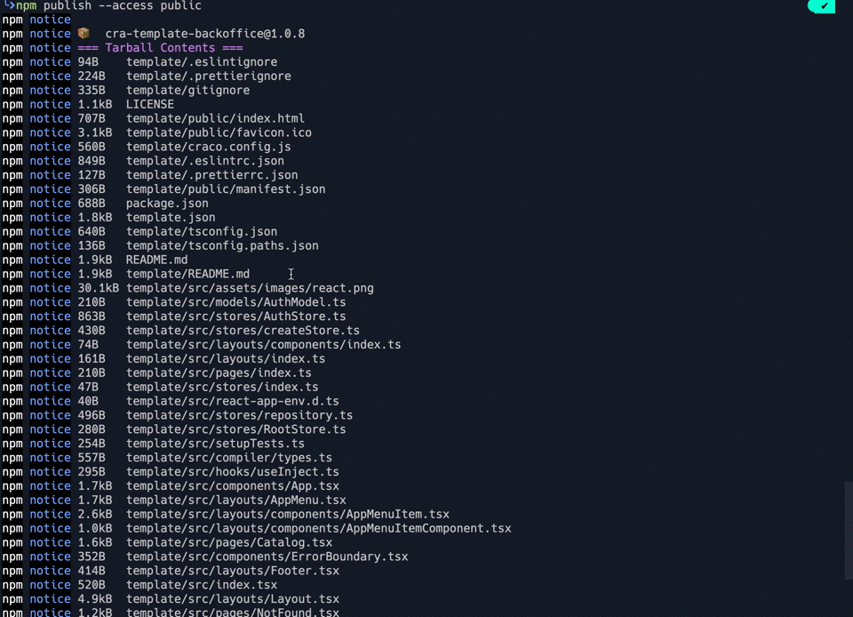

## 학습 목표

CRA (Create React App) Template 생성 및 배포후 다운받기.

## Ceate React App 이란 ?

Create React App은 React 앱을 빌드하고 개발 환경을 구축 시 엄청나게 유리한 고점을 시작으로 제공되는 도구이다.

시간이 많이 걸리는 React의 수많은 보일러플레이트 및 웹팩 설정 등을 절약 할 수 있다.

CLI를 통해 하나의 명령문만 실행하면 Create React App이 환경 구성을 갖춰서 마법처럼 React 프로젝트를 생성해준다


출처: [https://create-react-app.dev/docs/getting-started](https://create-react-app.dev/docs/getting-started)

### Custom CRA Template는 어떻게 활용할 수 있을까?

이미 기존에 Facebook 에서 잘 관리하고 있는 CRA가 있지만

`Redux`, `Mobx`, `react-router`  등 기본적으로 많이 사용하는 보일러 플레이트들을 다시 설치하고

파일 생성, 디렉토리 생성, 스토어 연결, 라우터 설정등 `CRA`를 사용하고도 프로젝트를 설정하고 있는 자신을 볼 수 있을 것이다.

하지만 자주 사용하는 Library, Structure, Framework 가 적용된 React Template을 사용할 수 있다면...?

배포된 template을 다운받아 zero configuration에서 프로젝트를 시작하면서 시간을 단축할 수 있다!

---

## Custom CRA Template 생성하기

### 프로젝트 생성

CRA 커스텀 템플릿을 만들기 위해선 조건이 있다.

1. CRA(create-react-app) 으로 새 프로젝트를 생성한다.
2. cra-template-{프로젝트명} prefix 붙여준다.
    - `cra-template-` 접두어를 붙여줘야 CRA 템플릿이라는걸 알 수 있다.

### 불필요한 파일 삭제 및 보일러 플레이 구성

CRA 생생된 프로젝트 내부에 불필요한 파일 및 dependencies 삭제 작업을 진행해준다.

> e.g. img, .css, .js 등...

그 후 입맛대로 Implementation & Configuration 을 해준다.

여기까지는 일반적인 React 프로젝트 생성후 실행까지 똑같다.

### template.json 생성

이 작업부터는 Custom CRA Template을 생성 및 배포하기 위한 필수 사전 작업이다.

`package.json` 에서 `dependencies, devDependencies, scripts, config` 를 **cut & paste 해준다.**

아래와 같이 `template.json` 를 프로젝트 루트 레벨에 생성해주고 붙여준다.

```json
//아래와 같은 구조
|-- {프로젝트}
  |-- public
  |-- src
    |-- .gitignore
  |-- LICENSE
    |-- package.json
    |-- template.json
    |-- yarn.lock
```

```json
//template.json 에시
{
 "devDependencies":{
  "@types/jest": "^24.0.0",
    "@types/node": "^12.0.0",
    "@types/react": "^16.9.0",
    "@types/react-dom": "^16.9.0",
    "@types/react-router-dom": "^5.1.5",
    "@types/styled-components": "^5.1.1",
    "@babel/plugin-proposal-class-properties": "^7.10.4",
    "@babel/plugin-proposal-decorators": "^7.10.4",
    "@babel/plugin-proposal-optional-chaining": "^7.10.4",
    "@typescript-eslint/eslint-plugin": "^3.7.1",
    "@typescript-eslint/parser": "^3.7.1",
    "eslint-config-prettier": "^6.11.0",
    "eslint-config-react-app": "^5.2.1",
    "eslint-plugin-prettier": "^3.1.4",
    "eslint-plugin-react": "^7.20.5",
    "prettier": "^2.0.5",
    "remotedev": "^0.2.9"
 },
  "dependencies": {
    "@craco/craco": "^5.6.4",
    "@material-ui/core": "^4.11.0",
    "@material-ui/icons": "^4.9.1",
    "@testing-library/jest-dom": "^4.2.4",
    "@testing-library/react": "^9.3.2",
    "@testing-library/user-event": "^7.1.2",
    "axios": "^0.19.2",
    "clsx": "^1.1.1",
    "mobx": "^5.15.4",
    "mobx-react-lite": "^2.0.7",
    "mobx-state-tree": "^3.17.2",
    "react": "^16.13.1",
    "react-dom": "^16.13.1",
    "react-error-boundary": "^2.3.1",
    "react-router-dom": "^5.2.0",
    "react-scripts": "3.4.1",
    "shortid": "^2.2.15",
    "typescript": "~4.1.2",
    "core-decorators": "^0.20.0",
    "mst-middlewares": "^3.17.2",
  },
  "scripts": {
    "start": "craco start",
    "build": "craco build",
    "test": "react-scripts test",
    "eject": "react-scripts eject",
    "lint": "eslint --ext .js,.jsx,.ts,.tsx src --color",
    "format": "prettier --ignore-path .gitignore --write 'src/**/*.{ts,tsx,scss,css,json}'",
    "isready": "yarn format && yarn lint && yarn build"
  },
  "eslintConfig": {
    "extends": "react-app"
  }
}
```

여기까지 왔다면 이제 반절 했다..하얗게 불태우기엔 너무 멀었다🔥 

### template 폴더 생성

프로젝트 루트 레벨에 `template` 폴더를 만든다.

이 부분에 오면 대강 `template` 폴더와 `template.json` 을 왜 생성해주는지 눈치 챌것이다.(아니라면..그대로 따라해보자)

- `template` 폴더 생성
- `public`, `src` 폴더 `template/` 하위로 이동
- 그외 config 에 필요한 파일들 이동 (e.g. `.eslintrc.json, .prettierrc.json, tsconfig.json`)

```json
//아래와 같은 구조
|-- {프로젝트}
  |-- template
    |-- public
    |-- src
    |-- README.md
    |-- .eslint.json
    |-- .prettierrc.json
    |-- tsconfig.json
    |-- .gitignore
  |-- LICENSE
    |-- package.json
  |-- README.md
    |-- template.json
    |-- yarn.lock
```

### gitignore 생성

눈치 채듯이 사용자는 내가 만든 `{project}/template` 을 다운 받아 사용하게 된다.

그래서 프로젝트 환경 및 설정에 관한 모들 파일들이 `template` 폴더 하위에 들어가게 된다.

그런데 `.gitignore`는 프로젝트 레벨에 있는데 자연스럽게 들어가는 것일까?


정답은 **NO** 입니다 🤨

`gitignore` 파일을 만들어줘야 한다.

밑줄 쫙___ **여기서! 주의 할 사항**

- 템플릿 폴더 내의 gitignore 는 `.` 이 없어야 한다.

**gitignore** 파일을 만들어줘야 한다.

귀찮으면 아래와 같이 터미널에 입력한다.

CRA는 template 내부에 있는 gitignore를 참조해 template을 사용할때 `.gitignore`로 변환해준다.

```bash
cp .gitignore template/gitignore
```

## NPM에 배포하기

우리가 지금까지 만든 **Template**은 이제 지구의 모든 사람들이 다운 받아 사용할 수 있게 배포할 준비가 되었다.

이제 나머지 모든 작업은 터미널의  CLI를 통해 진행할 것이다.

### NPM 로그인

npm에 로그인을 해보자. 없다면 [계정을 생성](https://www.npmjs.com/signup)하고 오면 된다.

```powershell
npm login
```

위와 같이 커맨드라인을 입력하면 아래와 같이 3가지 입력 항목이 나온다.

- Username : npmjs 에 등록된 이름
- Password : 비밀번호
- Email : 이메일
- authenticator(optional) : two factor(이중 인증) 설정되어있으면 1회성 인증을 해줘야 한다.

위 정보를 모두 입력하면 로그인에 성공된 메세지를 볼 수 있다.



### NPM 배포하기

이 문서에서 Guide 하고 싶은건 공개된 레포이므로 아래 가이드는 공개된 엑세스로 패키지를 배포하겠다.

cra-template-backoffice 이름을 가진 템플릿이 배포 완료되었다.

만약 이미 NPM에 존재하는 이름을 가진 프로젝트의 경우 duplicate error가 날 수 있다.

이때는 다른 이름으로 변경해서 다시 시도해보면 된다.

```powershell
npm publish --access public
```



### 배포된 Template 다운받기

npx,npm 혹은 yarn 패키지 매니저를 통해 다운받을 수 있다.

초반에 이야기했던 `cra-template-` prefix 궁금증도 여기서 풀린다.

create-react-app 의 템플릿중 `backoffice` 의 이름을 가진 템플릿을 다운받을 수 있다.

```powershell
npx create-react-app %PROJECT_NAME% --template backoffice
yarn

yarn create react-app %PROJECT_NAME% --template backoffice
```


### chore: NPM version 뱃지 붙이기

[Version Badge for npm, RubyGems, PyPI, Bower and other packages](https://badge.fury.io/)

위 사이트에서 내가 배포한 패키지 이름을 쓰면 그에 맞는 버전 뱃지 URL을 준다.

README 파일에 버전 이미지를 붙여놓으면 시멘틱 버저닝을 하고 있는 프로젝트에서 package.json 의 버전 수정 시 README에 변경된 버전의 뱃지가 붙어진걸 확인할 수 있다.

아니면 아래 사이트에서 커스텀 static 한 뱃지를 붙여놓을 수 있다.

[Shields.io: Quality metadata badges for open source projects](https://shields.io/)

## 참고

[cra-template-backoffice](https://www.npmjs.com/package/cra-template-backoffice)

[Create React App](http://create-react-app.dev)

[Custom templates with Create React App](https://tomvalorsa.com/blog/custom-templates-with-create-react-app/)
