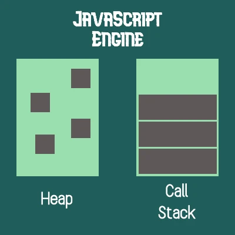

자바스크립트는 **단일 쓰레드(single thread)**이며, **콜백 큐(callback queue)**를 이용합니다.

## 자바스크립트 엔진
자바스크립트 엔진 중 구글의 V8 엔진은 크롬과 Node.js에서 사용됩니다. V8 엔진은 크게 **메모리 힙(Memory Heap)**과 **콜 스택(Call Stack)**으로 구성되는데 각각 다음과 같습니다.



* 메모리 힙 : 메모리 할당이 이뤄지는 곳
* 콜 스택 : 코드가 실행되면서 스택 프레임이 쌓이는 곳

메모리 힙은 간단히 원시 타입이 아닌 타입이 저장되는 공간입니다.

## 런타임
브라우저는 자바스크립트 엔진에서 제공하지 않는 API를 제공하기도 합니다. 이를 Web API라고 하며 DOM, AJAX, setTimeout 등이 여기에 포함됩니다.

## 콜스택
자바스크립트는 단일 쓰레드 언어이며, 이는 곧 한 번에 한 가지 일만 할 수 있음을 의미합니다.

콜스택은 함수가 실행될 때 해당 함수가 스택의 제일 위에 쌓이게 됩니다. 그리고 해당 함수 실행이 완료된다면 스택에서 함수가 제거됩니다.

```js
function first() {
  second();
  console.log('first');
}

function second() {
  third();
  console.log('second');
}

function third() {
  console.log('third');
}

first();
```

위 코드는 `first()`, `second()`, `third()` 순서로 콜스택에 기록되며, 이 역순으로 스택에서 빠져나옵니다.

## 이벤트 루프
만약 수행 시간이 매우 오래 걸리는 함수가 콜 스택에 쌓이게 된다면 어떻게 될까요?

콜 스택에 함수가 쌓이면 해당 함수가 실행 완료될 때까지 브라우저는 아무런 행동도 할 수 없습니다. 이러한 현상을 ‘blocking’ 된다고 합니다. 콜스택 내의 작업을 수행하면서 오랫동안 응답이 없는 상태가 지속된다면 브라우저에서 에러를 일으키고 사용자에게 페이지를 닫을지 물어보기도 합니다.

이러한 현상을 해결하기 위해서 **비동기 콜백**을 사용할 수 있습니다.

### 자바스크립트 비동기 함수
자바스크립트 코드를 작성할 때 지금 당장 실행되는 함수가 아닌, 특정 작업이 완료된 이후에 실행되는 코드를 작성할 수 있습니다.

```js
var response = ajax('...');
console.log(response);
```

표준 Ajax 요청은 동기적으로 수행되지 않습니다(ajax 요청을 동기적으로 수행시킬 수 있는 방법이 없는 것은 아닙니다). 이는 곧 ajax 함수가 호출되는 시점에 response 변수에 값을 할당할 수 없음을 의미합니다.

비동기 함수가 결과를 반환할 때까지 기다리는 방법은 **콜백** 방식을 사용하는 것입니다.

```js
ajax('...', function (response) {
  console.log(response);
});
```

`setTimeout` 함수를 이용하면 `ajax` 이외의 함수도 비동기로 실행시킬 수 있습니다.

```js
function callback() {
  console.log('callback');
}

function first() {
  second();
  console.log('first');
}

function second() {
  third();
  console.log('second');
}

function third() {
  console.log('third');
}

setTimeout(callback, 1000);
first();
```

실행 결과는 다음과 같습니다.

```
first
second
third

callback // 1000ms 이후에 실행됩니다.
```

### 이벤트 루프 살펴보기
위 코드에서 살펴본 것처럼 `setTimeout` 함수를 이용해 비동기 코드를 작성할 수 있지만, 자바스크립트는 **단일 쓰레드**라고 하였습니다. 어떻게 비동기 콜백을 실행시킬 수 있는 것일까요?

자바스크립트 런타임(브라우저)에서 setTimeout 등과 같은 비동기 함수를 제공한다고 하였습니다. 이러한 환경에서는 **이벤트루프**가 일어나는데, 이는 코드의 수행을 처리할 때마다 JS 엔진을 동작시킵니다.

예를 들어 서버에서 데이터를 가져오기 위해 Ajax 요청을 하는 자바스크립트 프로그램은 함수 내에서 “응답” 코드를 작성하는데, 이는 JS 엔진이 런타임 환경에 이러한 요청을 합니다.

> “나는 코드 실행을 중단시킬 것이지만, 너는 네트워크 요청이 모두 끝나면 가져온 데이터를 이용해 이 함수를 호출해줘”

해당 요청을 받은 브라우저는 네트워크로부터의 응답에 대기하고 있다가 완료된다면 콜백 함수가 수행될 수 있도록 이벤트 루프에 삽입합니다.

이벤트 루프는 한 가지 일만을 하는데, 콜 스택과 콜백 큐를 감시하는 것입니다. 그리고 콜스택이 비어있을 때 이벤트 루프는 큐에서 첫 번째 이벤트를 가져와 콜스택에 쌓을 것입니다. 그리고 결과적으로는 콜백 함수를 실행시킵니다.

### setTimeout 함수

#### setTimeout 함수의 이벤트 루프 정리
1. setTimeout 함수가 **Call Stack**에 push 됩니다.
2. Call Stack에 들어온 setTimeout은 timer Browser API를 호출합니다.
3. timer API가 종료된다면 callback event가 실행될텐데, 이에 대한 정보는 **Event Table**이 알고 있습니다.
4. 이벤트 발생시 실행되는 callback 함수가 **Callback Queue**에 추가됩니다.
5. **Event Loop**가 일어납니다.
  1. Call Stack과 Callback Queue를 감시합니다.
  2. Call Stack이 **비어있다면** Callback Queue에서 함수를 꺼내 Call Stack에 추가합니다.

#### setTimeout(fn, 0)
`setTimeout` 함수에 delay를 0으로 지정할 수 있습니다.

```js
function callback() {
  console.log('callback');
}

function first() {
  second();
  console.log('first');
}

function second() {
  third();
  console.log('second');
}

function third() {
  console.log('third');
}

setTimeout(callback, 0);
first();
```

위 함수의 실행 결과는 어떻게 나올까요??

```
first
second
third
callback
```

위와 같이 표시되는 이유는 ‘callback’을 출력하는 콜백 함수가 **callback queue**에 쌓여 있다가 **call stack**이 모두 비워지면 **call stack**으로 이동되어 실행되기 때문입니다.
