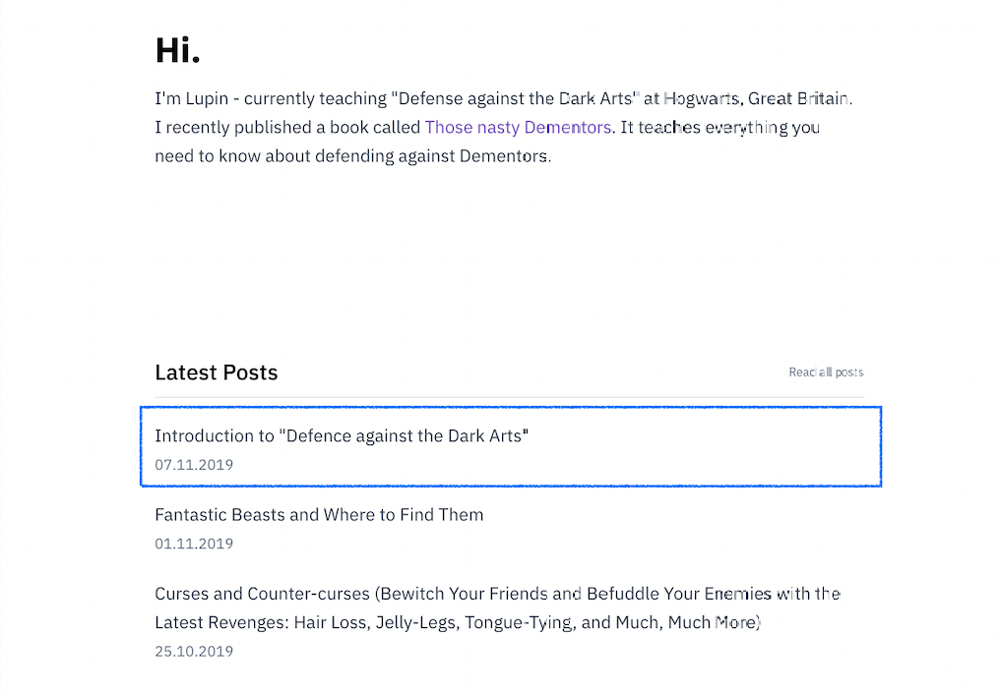
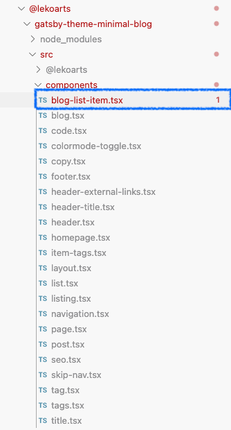
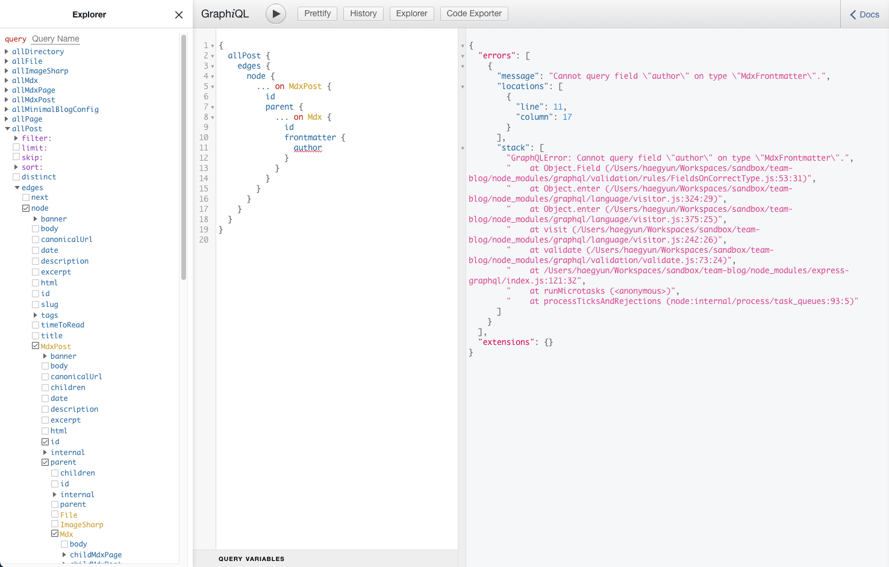
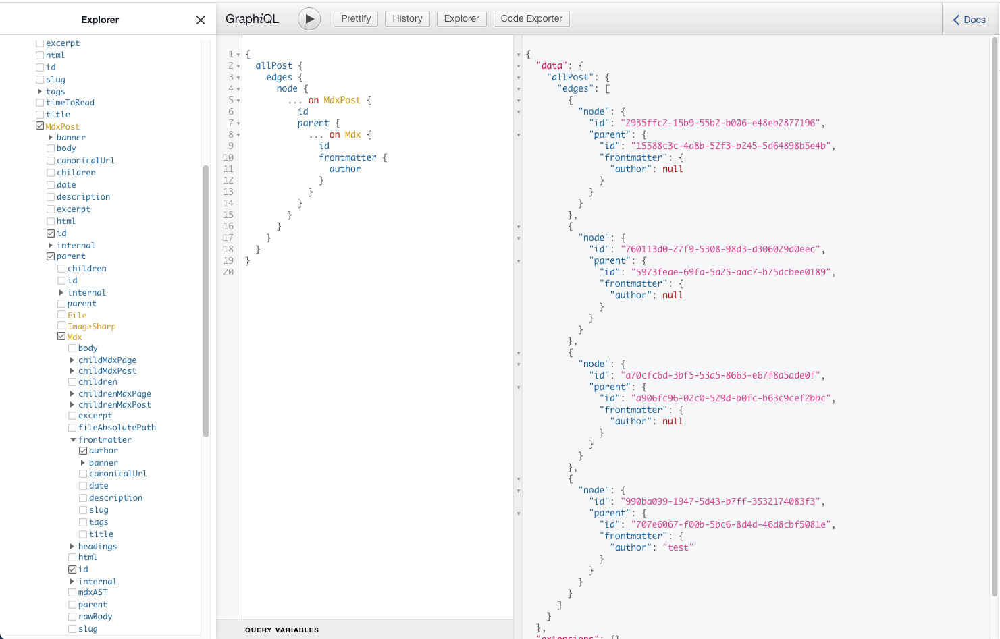
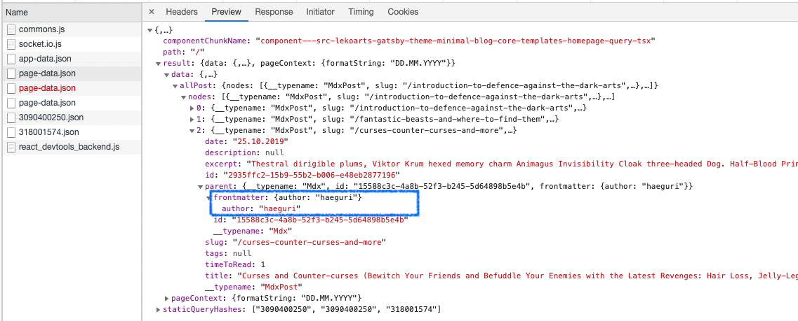
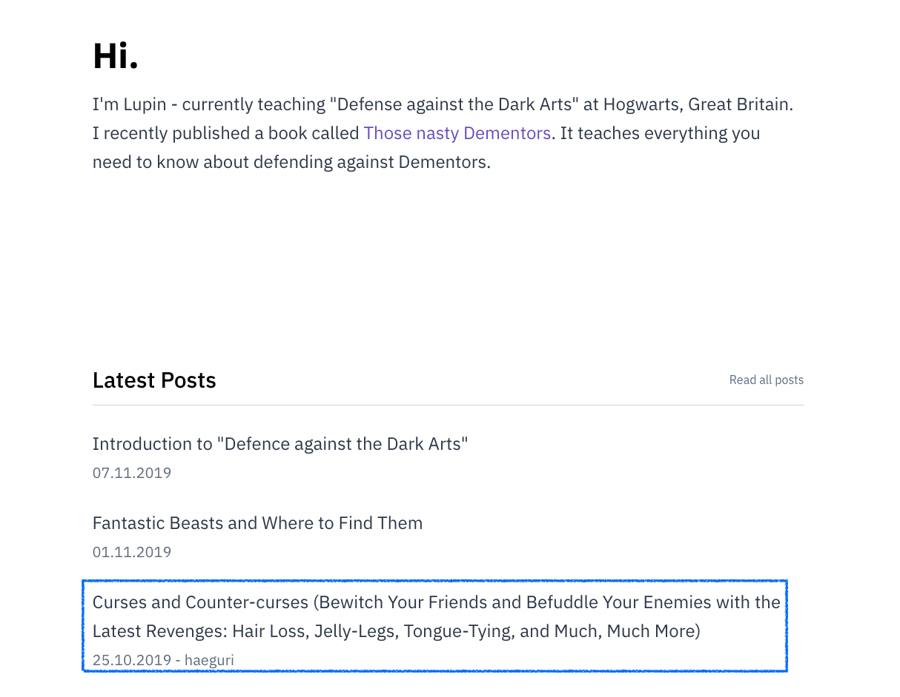

안녕하세요. 메쉬코리아 웹 프런트엔드 팀에서 일하고 있는 정해균이라고 합니다. 저희 팀에서는 이번에 팀 블로그를 시작했는데요, 이 글에서는 왜 팀 블로그를 만들게 되었는지, Gatsby 스타터로 팀 블로그를 만들려고 하시는 분들에게 도움 될 만한 내용을 정리해봤습니다.

### 1. 왜 만들었나요?

작년 말에 웹 프런트엔드 팀 회고가 있었습니다. 재택근무로 인해 원격으로 진행된 회고에서는 올해에 아쉬웠던 점에 관해서 이야기를 나눠보는 시간이 있었는데요, 이런 의견들이 있었습니다.

- 스터디 등의 팀 활동이 점차 줄었다.
- 기술적으로 **더 많이** 성장하고 싶었다.
- 만족감을 얻을 수 있는 팀 활동이 많아졌으면 좋겠다.

이 의견들은 "기술적으로 성장할 수 있는 팀 활동 더 많아졌으면 좋겠다."로 정리할 수 있었는데요, 함께 성장할 수 있는 활동이 무엇일지 의견을 나눠봤습니다. 그리고 회고의 액션 아이템 중 하나로 **팀 블로그 운영**을 해보기로 했습니다.

#### 공식 테크 블로그인가요?

[메쉬코리아의 공식 테크 블로그](https://mesh.dev/)는 따로 있습니다. 하지만 공식 테크 블로그에 글 작성하는 일이 아무래도 신경 써야 할 것이 더 많기 때문에 먼저 팀 블로그에 글을 올려보기로 했습니다. 그리고 팀 블로그는 어떤 기술을 깊이 있게 다루는 주제가 아니라도 가벼운 주제로 글을 작성할 수 있는 공간으로 만들기로 했습니다. 만약 괜찮은 글이 있다면 공식 테크 블로그에도 소개해보기로 했습니다.

---

### 2. 시작하기

회고 이후에 팀 블로그를 어떻게 만들어야 할지 이야기하기 위해 두 번의 미팅을 진행했습니다. 블로그 제작은 제가 Gatsby로 만들어보기로 했습니다. 사실 Gatsby로 블로그를 만들어본 경험은 없었지만, 구축에 들어가는 시간을 줄이기 위해 Gatsby 스타터를 사용하기로 했습니다.

#### 테마 선택하기

생각보다 다양한 Gatsby 스타터들이 있었고 그중에서 어떤 스타터를 선택해야 할지 고민했습니다. 가장 중요한 기준은 아래와 같았습니다.

- 모바일 화면에서도 잘 나오는가?
- 심플한 디자인인가?
- 글에서 작가 정보를 확인할 수 있는가?

몇 개의 후보들을 놓고 팀원분들이 투표에 참여해주셨고 결과를 취합해서 **[gatsby-theme-minimal-blog](https://www.gatsbyjs.com/plugins/@lekoarts/gatsby-theme-minimal-blog/)**를 사용해 보기로 했습니다. 이 테마는 심플한 디자인을 하고 있고, 모바일에서도 깔끔하게 잘 나오는 점이 마음에 들었습니다. 다만 개인 블로그 템플릿을 위해 만들어졌는지, 글마다 작가 정보를 확인할 수는 없었습니다. 그래서 작가 정보는 직접 추가해보기로 했습니다. 

#### 주제 선정

사실 각자 어떤 글의 주제를 정할지도 이야기해 봤지만, 우선은 주제는 자유롭게 선정하기로 결정했습니다. 대신 컨텐츠가 어느 정도 쌓이면 글을 작성하는 가이드를 만들어보기로 했습니다.

---

### 3. 만들어보기

제일 먼저 블로그 글 목록에서 각 글의 작가 정보를 표시하려고 합니다. 팀 블로그인 만큼 글을 누가 썼는지 정도는 알 수 있어야 한다고 생각했습니다. 그리고 작가 정보를 추가하면서 알면 아래 것들을 경험해볼 수 있었습니다. 

- Gatsby 스타터에서 제공하는 컴포넌트를 수정하는 방법
- 데이터 소스를 추가하는 방법

#### 스타터의 컴포넌트 수정하기

우선 gatsby-starter-minimal-blog 스타터를 기반으로 `my-team-blog` 프로젝트를 생성해줍니다.

```bash
gatsby new my-team-blog LekoArts/gatsby-starter-minimal-blog
```

목표는 아래 캡처 화면에 표시된 영역에 작가 정보를 추가하는 것입니다. 



다행히도 Gatsby에서는 **[Shadowing](https://www.gatsbyjs.com/docs/how-to/plugins-and-themes/shadowing/)**이라는 기능을 제공하는데요, Shadowing을 이용하면 Gatsby 스타터에서 구현된 컴포넌트를 내 프로젝트에서 구현한 컴포넌트로 대체할 수 있습니다.

우선은 "**수정해야 할 Gatsby 스타터 컴포넌트**"가 어떤 것인지 찾아야 합니다. 명령어 한 줄로 컴포넌트를 찾을 수 있다면 좋겠지만, 저는 아래 단계를 거쳐서 수정해야 할 스타터 컴포넌트를 찾아야 했습니다.

1. `node_modules`에서 Gatsby 스타터가 설치된 경로를 찾는다.
2. 컴포넌트 이름을 살펴보고 내가 수정하려는 컴포넌트일지 추론해본다.
3. 그 컴포넌트의 소스 코드를 직접 살펴보고 확인한다.

수작업으로 진행해야 한다는 점에서 그다지 우아하지 않은 방법이지만 지금까지 다른 방법은 찾지 못했습니다...

#### 수정해야 하는 컴포넌트 찾기

`my-team-blog` 프로젝트의 `package.json`의 `dependencies`를 살펴보면 gatsby-theme-minimal-blog는 디펜던시 이름이 `@lekoarts/gatsby-theme-minimal-blog`인 것을 확인할 수 있습니다.

```markdown
  "dependencies": {
    "@lekoarts/gatsby-theme-minimal-blog": "^2.7.3",
    ...
```

그럼 `node_modules`의 `@lekoarts/gatsby-theme-minimal-blog` 디렉터리로 이동해보면 스타터의 소스 코드가 있습니다. 앞에서 언급했듯 이번에 수정해야 하는 컴포넌트는 블로그 글 목록에서 보이는 컴포넌트인데요, 이 중에서 `blog-list-item.tsx` 가 가장 유사해 보이는 이름이었고, 소스 코드를 살펴보니 제가 수정하려는 컴포넌트가 맞았습니다.



#### 컴포넌트 수정하기

수정해야 하는 Gatsby 스타터 컴포넌트를 찾았으니, 이제 Shadowing을 이용하여 `my-team-blog` 프로젝트에서 구현하는 컴포넌트로 갈아 끼울 수 있어야 합니다. 먼저, Shadowing으로 컴포넌트를 갈아 끼우려면 수정하려는 컴포넌트의 경로를 알아야 합니다.

앞에서 찾아낸 `blog-list-item.tsx` 컴포넌트의 경로는 아래와 같습니다.

```
node_modules/
	@lekoarts/
		gatsby-theme-minimal-blog/
			src/
				components/
					- blog-list-item.tsx
```

그러면 `my-team-blog` 프로젝트에서는 다음과 같이 폴더를 생성해야 합니다. 

```
src/
  @lekoarts/
		gatsby-theme-minimal-blog/
			components/
			  - blog-list-item.tsx
```

정리하면 `src` 폴더 밑에 Gatsby 스타터와 동일한 이름의 디렉터리를 생성해야 하고, 그 아래에 `components` 디렉터리를 만들어 수정하려고 하는 컴포넌트의 이름과 동일한 파일을 생성해야 합니다.

다음으로 `node_modules`에서 찾았던 Gatsby 스타터 컴포넌트의 소스 코드를 복사합니다. 그리고 `my-team-blog` 프로젝트의 `src` 하위에 있는 `blog-list-item.tsx` 파일에 붙여넣고, 원하는 대로 컴포넌트를 수정합니다. 저는 작가 정보를 추가했습니다.

```tsx
const BlogListItem = ({ post, showTags = true }: BlogListItemProps) => (
  <Box mb={4}>
    <TLink as={Link} to={post.slug} sx={{ fontSize: [1, 2, 3], color: `text` }}>
      {post.title}
    </TLink>
    <p
      sx={{
        color: `secondary`,
        mt: 1,
        a: { color: `secondary` },
        fontSize: [1, 1, 2],
      }}
    >
      <time>{post.date}</time>
      {post.tags && showTags && (
        <React.Fragment>
          {` — `}
          <ItemTags tags={post.tags} />
        </React.Fragment>
      )}
      {post.author && (
        <React.Fragment>
          {` - `}
          {post.author}
        </React.Fragment>
      )}
    </p>
  </Box>
);
```

#### 데이터 소스 추가하기

Gatsby dev 서버를 다시 시작해보면, 아직 포스트에 작가를 추가하지 않았기 때문에 포스트 목록에서 작가에 대한 정보는 나오지 않습니다. 이제 작가에 대한 정보를 추가해야 합니다.

추가하기 전에 포스트 객체에 어떤 필드들이 있는지 확인하려고 합니다. Gatsby는 GraphQL을 사용해서 정적 사이트 생성에 필요한 데이터를 불러옵니다. Gatsby는 GraphQL을 더 쉽게 사용할 수 있게 **GraphiQL**라는 도구를 제공하는데요, 이 도구를 사용하면 프로젝트에서 어떤 객체와 필드를 요청할 수 있는지 미리 볼 수 있습니다. 그리고 GraphQL 쿼리문도 직접 작성해서 데이터를 잘 불러오는지 테스트도 해볼 수 있습니다. GraphiQL 페이지로 진입하는 방법은 브라우저 주소창에 `localhost:8000/___graphql`를 입력하면 됩니다.



Explorer 영역에서 클릭 몇 번으로 쿼리문을 수정할 수도, 중간의 편집기 영역에서 쿼리문을 직접 수정할 수도 있습니다. 아래의 쿼리문을 복사하여 GraphiQL 편집기에 붙여넣기 해보면 에러가 발생하는데요, 이제 해야 할 일은 이 쿼리문을 실행했을 때 에러가 발생하지 않게 하는 일입니다.

```graphql
{
  allPost {
    edges {
      node {
        ... on MdxPost {
          id
          parent {
            ... on Mdx {
              id
              frontmatter {
                author
              }
            }
          }
        }
      }
    }
  }
}
```

#### frontmatter 필드 추가하기

frontmatter는 마크다운 파일에서 메타 데이터를 작성하는 영역으로 사용됩니다. 참고로 [frontmatter](https://www.scribendi.com/academy/articles/front_matter.en.html)는 Gatsby 기반 사이트에서만 사용되는 것은 아닙니다. 예전에 hexo를 사용해서 개인 블로그를 만들었을 때도 frontmatter에 제목, 작성일과 같은 정보들을 작성했었습니다. frontmatter는 아래와 같은 포맷으로 되어 있습니다.

```markdown
---
title: 팀 블로그의 첫 번째 글
date: 2021-02-21
---

# 소개

# 배경
```

`---` 사이에는 `title`, `date` 와 같은 정보가 있습니다. 여기에 `author`를 추가해줍니다

```markdown
---
title: 팀 블로그의 첫 번째 글
author: haeguri
date: 2021-02-21
---

# 소개

# 배경
```

`author` 필드를 추가한 후에 Gatsby dev 서버를 다시 시작하고, `localhost:8000/___graphql` 페이지로 이동합니다. 그리고 아까 실행했던 쿼리문을 다시 실행하면 추가했던 author 필드를 조회하는 쿼리문이 정상적으로 실행되는 것을 알 수 있습니다.



#### graphql 쿼리 수정하기

지금까지 post에 author 정보를 추가하는 방법과 어떻게 조회할 수 있는지 확인했습니다. 다음으로 마크다운 파일에 추가했던 `author` 정보가 화면에 표시되어야 합니다. 하지만, `localhost:8000`에서 확인해도 작가에 대한 정보는 나오지 않습니다. 

이제부터 `blog-list-item.tsx` 컴포넌트에 주입되는 `post` 객체에도 `author` 필드를 추가하기 위해서GraphQL 쿼리문을 수정해야 합니다.

#### 수정해야 할 쿼리문 찾기

수정해야 할 쿼리문을 찾는 일도, 수정해야 하는 컴포넌트를 찾는 것과 비슷하게 `node_modules`에 있는 Gatsby 스타터 설치 경로를 살펴봐야만 했습니다. gatsby-theme-minimal-blog는 특이하게 **gatsby-theme-minimal-blog-core**라는 디펜던시에서 쿼리문을 정의하고 있었습니다! 

gatsby-theme-minimal-blog-core에 있는 쿼리문의 경로는 다음과 같습니다. 

`node_modules/@lekoarts/gatsby-theme-minimal-blog-core/src/templates/homepage-query.tsx`

```markdown
node_modules/
	@lekoarts/
		gatsby-theme-minimal-blog-core/
			src/
				templates/
					- homepage-query.tsx
```

그리고 Shadowing하기 위해 파일을 복사해서 `my-team-blog` 프로젝트의 다음의 경로에 붙여넣기 했습니다.

```markdown
src/
  @lekoarts/
		gatsby-theme-minimal-blog-core/
			components/
			  - homepage-query.tsx
```

마지막으로 author를 추가로 요청하기 위해 쿼리문을 수정합니다.

```tsx
import { graphql } from "gatsby"
import BlogComponent from "../components/blog"

export default BlogComponent

export const query = graphql`
  query($formatString: String!) {
    allPost(sort: { fields: date, order: DESC }) {
      nodes {
        slug
        title
        date(formatString: $formatString)
        excerpt
        timeToRead
        description
        tags {
          name
          slug
        }
        ... on MdxPost {
          id
          parent {
            ... on Mdx {
              id
              frontmatter {
                author
              }
            }
          }
        }
      }
    }
  }
`
```

Gatsby dev 서버를 다시 실행한 후에 `localhost:8000`로 이동한 후에 개발자 도구에서 데이터 요청 결과를 확인해보면 변경된 쿼리문이 잘 적용된 것을 확인할 수 있습니다.



#### blog-list-item 수정하기

마지막으로 `my-team-blog`에서 다시 정의한 `blog-list-item.tsx` 컴포넌트를 수정합니다. 앞에서는 `post.author`로 작가 정보를 가져오려고 했었으나, 작가 정보를 가져오는 코드를 조금 수정합니다.

```tsx
const BlogListItem = ({ post, showTags = true }: BlogListItemProps) => (
      /* .... */
      {post.parent.frontmatter.author && (
        <React.Fragment>
          {` - `}
          {post.parent.frontmatter.author}
        </React.Fragment>
      )}
    </p>
  </Box>
);
```

`localhost:8000` 에 접속하여 결과를 확인하면 아래에 표시된 것처럼 작가 정보가 잘 추가된 것을 확인할 수 있었습니다.



### 3. 마치면서

팀 블로그 개발을 Gatsby로 해보겠다고 다짐했을 때는 GraphQL에 대해서도 함께 알아보면 좋겠다고 생각했습니다. 팀 블로그 제작 후기에 대해 글을 쓸 때, "GraphQL에 대해서도 간단하게 설명해보면 좋지 않을까?"라는 생각도 했었습니다.


하지만 막상 시작하고 보니 어려운 점이 많았습니다. 처음에는 Gatsby에서 사용되는 GraphQL을 어느 정도 이해한 상태에서 팀 블로그를 만들고 싶었는데, 마치기로 한 날짜가 다가오면서 마음이 급해졌고 결국은 그냥 빠르게 만들어보자는 마음으로 일을 진행했습니다.

이 과정에서 GraphQL에 대해서 제대로 다뤄보지는 못했는데요, 다음에 팀 블로그 기능을 업데이트할 기회가 있다면 GraphQL에 대해서 조금 더 공부하고 진행해보면 좋을 것 같습니다.

## 참고

- [gatsby-theme-minimal-blog](https://www.gatsbyjs.com/plugins/@lekoarts/gatsby-theme-minimal-blog/)
    - 이번에 사용한 Gatsby 스타터
    - 컴포넌트를 수정하는 방법, 사이트의 메타 데이터를 수정하는 방법이 잘 나와 있습니다.
- [Gatsby Tutorial](https://www.gatsbyjs.com/docs/tutorial/)
- [Gatsby How to Guide](https://www.gatsbyjs.com/docs/how-to/)
