## 제네릭 타입을 사용하는 리액트 드랍다운을 만들어 보자

### What is the problem?

메쉬코리아에서 개발해 관리하는 리액트 컴포넌트 라이브러리인 vroong-design-system 안에는
드랍다운 컴포넌트가 있다.

이 드랍다운 컴포넌트는 선택지를 만들어주는 options 프라퍼티를 필수적으로 받고 있는데,
아래 옵션 데이터를 배열로 받고 있다.

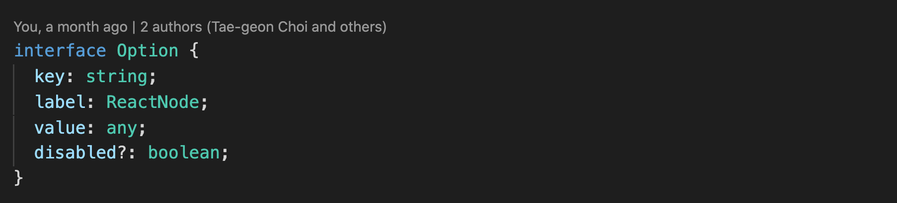

- 코드 내부적으로 데이터를 찾고 관리하기 위해 사용되는 key
- 사용자에게 보여질 옵션을 설정하기 위해 사용되는 label
- 그리고 실제 해당 옵션의 데이터인 value

그런데 현재 value의 타입이 any로 설정이 되어 있어서 컴포넌트 사용중 생기는 문제가 있다.
분명히 드롭다운 컴포넌트 내에서 옵션마다 사용되는 value의 형태는 같은데 코드 상에서 그 타입을 유추해 내지 못하기 때문에

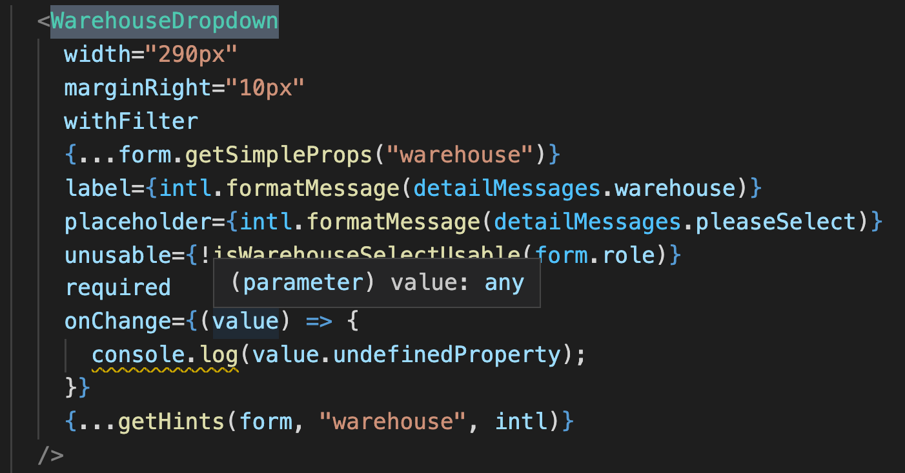

위의 onChange 처럼 없는 프라퍼티에 접근하는게 가능해진다던가, value로 만약 undefined 가 들어간다면

> Uncaught TypeError: Cannot read property 'please' of undefined

를 볼 수도 있다.

### 컴포넌트에 제네릭 타입을 사용해 문제 해결 해보기

만약 일반함수에 제네릭 타입을 정해 사용하듯이 컴포넌트에도 제네릭 타입을 사용할 수 있다면 option의 value로 어떤 값을 사용하는지 특정할 수 있고
value가 any여서 생길 수 있는 여러 문제를 미연에 방지 할 수 있을 것이다.

여러 시행착오를 거치면서 우선 원하는대로 제네릭 컴포넌트를 구현하는것에는 성공했지만 아쉬운 점이라던가 걸리는 부분이 남아있다.

우선 구현법을 먼저 설명하고 아쉬운 점에 대해 추가로 메모를 첨부하려고 한다.

#### 구현법

우선 드랍다운이 받는 프라퍼티가 제네릭을 사용하도록 수정한다.
value와 options props들에 제네릭 타입을 적용시켜준다.

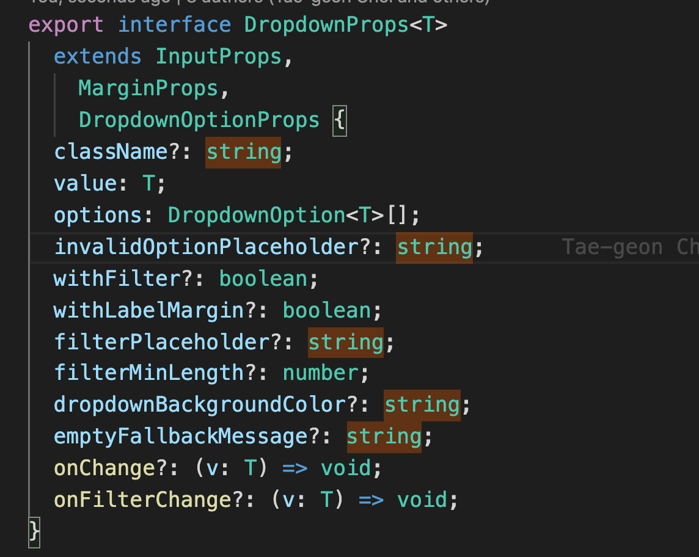

그리고 그 제네릭 타입을 내려내려줘서 옵션의 value로 설정해준다.

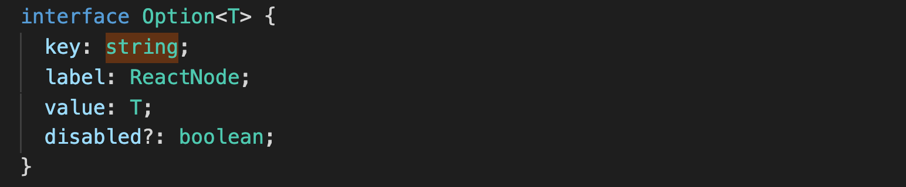

이제 수정된 프라퍼티를 컴포넌트가 사용하도록 코드를 수정한다.

FC를 사용하는 syntax 에서는 문법이 잘 작동하지 않기 때문에 프라퍼티 앞에 제너릭 선언을 해주고 그 제너릭을 prop에 적용시켰다.

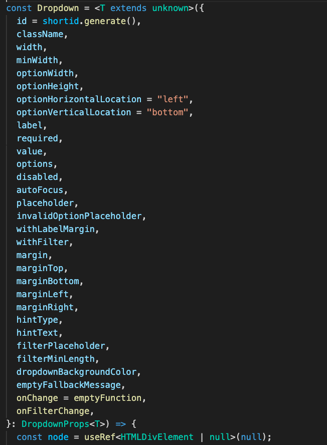

_extends unknown 을 굳이 한 이유는 arrow function 형태에서 `<T>` 이렇게만 하면 syntax 오류가 생기기 때문이다. 그렇게 사용하고 싶다면 일반 함수로 컴포넌트를 만들면 된다._

자 이제 제네릭을 적용하기 위해서 컴포넌트가 사용되는 곳에 가서

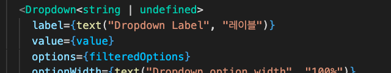

이렇게 컴포넌트를 사용하는곳에 제네릭 타입 문법을 붙여준다. 우선은 흔히 사용되는 value 값인 `<string | undefined>` 을 사용했다.

그럼 제네릭 타입을 그냥 `string`으로 설정해 준다면?

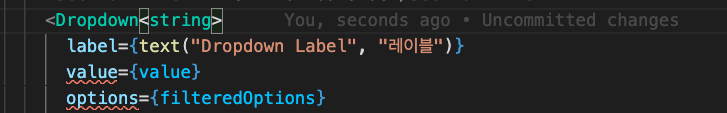

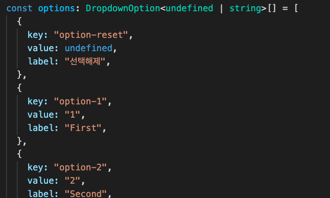

undefined 가 value 가 될 수 있는 변수를 options props에 넣으려고 하니 타입 오류가 잡힌다! 제너릭을 통해 드랍다운이 사용하는 value 값의 타입을 특정할수 있게 된 것이다.

단순 데이터가 아닌 오브젝트를 value 로 사용할때도 타입이 정해져 있기 때문에 훨씬 안전하게 사용이 가능하다.

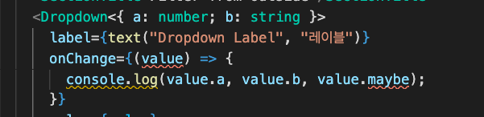

#### 아쉬운점

에 일단 되게는 만들었지만 업무에 잘 사용하기에는 아쉬운점들이 있다.

1. 타입스크립트의 제너릭 문법과 리액트의 jsx가 둘다 < > 기호를 사용하다보니 syntax 오류가 많이 잡히면서 지원되지 않는 문법들이 존재한다.

2. 컴포넌트에 매번 제너릭을 정해주기가 불편하니 `const Test = <T = string>(props: Prop<T>)` 이런 식으로 default 타입을 설정해봤지만 막상 컴포넌트 옆에 제너릭을 정하지 않으니 T 에 대한 값이 string으로 강제되지 않는 문제가 생겼다.

   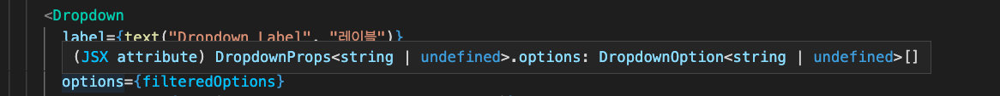

   _default 타입은 string인데 options 값으로 `string | undefined` 가 들어오니 컴포넌트의 T 값이 해당 값을 받을 수 있도록 변형된것을 볼 수 있다._

3. 만약 타입스크립트에서 제너릭 함수를 선언할때 제너릭의 default 타입이 없고, 함수를 사용할때 제너릭을 설정해주지 않는다면 타입 에러가 나는데. 제너릭 컴포넌트는 default type이 없더라도 타입 오류를 잡아주지 않는다.

   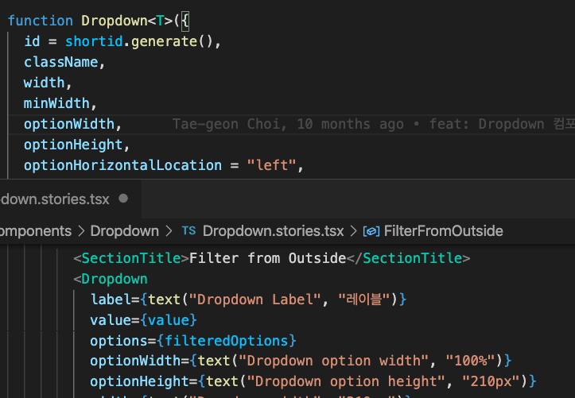

   _위에 제너릭 기본 타입이 없기 때문애, 드롭다운 컴포넌트를 사용할때 제너릭 타입을 정해주지 않는다면 타입 오류로 처리해주면 좋겠지만 현재 그런 기능은 없는것 같다._

1, 2 번 문제는 불편한대로 참고 사용할 수 있을 것 같지만 3번 문제는 해당 컴포넌트가 제너릭인지 모르는 사람이라면 계속 모르고 사용할 가능성이 있기 때문에 lint 룰을 추가하든가 해서 오류로 잡아줄 수 있다면 현재 코드베이스에 개선점으로 반영시켜도 좋을 것 같다.

다음에는 그 작업을 이어서 해보려고 한다.

참고:

- [https://dev.to/janjakubnanista/a-peculiar-journey-to-a-generic-react-component-using-typescript-3cm8](https://dev.to/janjakubnanista/a-peculiar-journey-to-a-generic-react-component-using-typescript-3cm8)

- [https://www.reddit.com/r/typescript/comments/dv07sp/react_typing_generic_function_components/](https://www.reddit.com/r/typescript/comments/dv07sp/react_typing_generic_function_components/)
