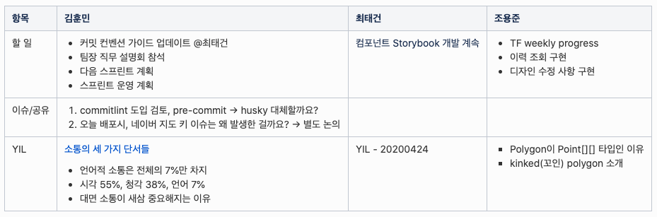

# 데일리 미팅 가이드

## 01. 데일리 미팅의 목표

데일리 미팅은 매일, 업무 진행 상태를 확인하고 조율하는 자리입니다. 우리가 하는 일은 매우 불확실해서 해보기 전에는 알 수 없는 것들로 가득합니다. 그래서 일을 진행하면서 알게 된 사실을 계속 공유하고 업무를 조정해야 합니다. 데일리 미팅은 참여자가 자신의 정보를 공유하고 빨리 자신이 겪고 있는 문제를 드러내서 동료와 협력하도록 돕는 자리입니다. 프로세스에 매몰되지 않기 위해서 미팅은 가능한 짧게(10분 - 20분 정도) 끝을 냅니다.

## 2. 프로세스

데일리 미팅은 아래의 단계로 진행을 합니다.

1. 출근 직후
   - 업무 계획
2. 데일리 미팅
   - 체크인
   - 데일리 로그 리뷰
   - 미팅 개설

### 1) 출근 직후

#### 업무 계획

출근을 하면 바로 위키의 데일리 로그 페이지에 자신이 어제 했고, 오늘 할 업무를 정리합니다. 업무와 관련 있는 사람을 할 일 옆에 태그를 달아서 알림을 줄 수도 있습니다. 공유를 해야하거나 함께 논의하고 싶은 내용도 입력을 해주세요.

### 2) 데일리 미팅

#### 체크인

현재 상태를 5점 만점의 별점으로 공유합니다. 이 단계에서 두 가지 효과를 얻을 수 있습니다.

1. 동료의 현재 상태를 읽고 조치를 할 수 있습니다.
2. 어색함을 덜고, 참여하게 만듭니다.

#### 데일리 로그 리뷰

오늘의 데일리 로그를 함께 2분간 정독합니다. <u>"동료가 오늘 할 일 중에서 나와 관계 있는 일"</u>이 있는지, 잘 살펴주세요. 로그를 정독한 후에는 한 명씩 순서대로 돌아가면서 동료에게 질문을 받습니다. 이 때 질문을 하는 사람은 도움을 제안을 할 수 있으며, <u>5분 이내</u>로 짧은 논의를 할 수 있습니다.

#### 미팅 개설

논의를 하는 데에 5분 이상 소요될 것 같은 내용은 데일리 미팅에서 다루지 않습니다. 논의할 주제별로 미팅 개설 담당자와 참여자를 할당하여, 데일리 미팅 후에 논의를 진행할 수 있게 돕습니다.
