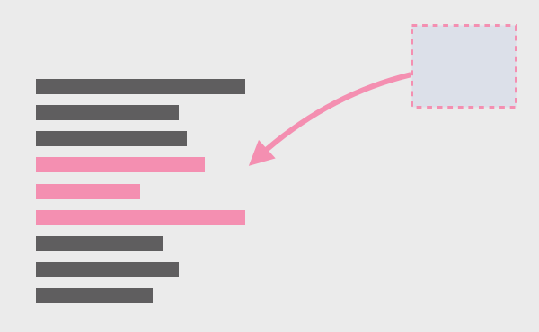

# 함수 인라인하기(Inline Function)

함수를 호출하는 코드를 함수 본문으로 대체하는 기법.



### 🧐 As is

```jsx
function getRating(driver) {
	return moreThanFiveLateDeliveries(drive) ? 2 : 1;
}

function moreThanFiveLateDeliveries(driver) {
	return drive.numberOfLateDeliveries > 5;
}
```

### 😍 To be

```javascript
function getRating(driver) {
	return (drive.numberOfLateDeliveries > 5) ? 2 : 1;
}
```

### 🗣 설명

함수 본문을 함수 이름 뒤로 감추지 않고 직접 드러내는 게 더 유리할 때 함수를 호출하는 코드를 함수 본문으로 대체하는 방법. 주로 리팩터링을 하는 중간에 논리를 한 곳으로 모으기 위해서 사용하며, 단순히 위임만 하는 함수가 너무 많은 경우에도 사용할 수 있다.

### ⚙️ 절차

1. 다형 메서드인지 확인한다. 다형 메서드라면 인라인을 하면 안 된다.
2. 인라인할 함수를 호출하는 곳을 모두 찾는다.
3. 각 호출문을 함수 본문으로 교체한다.
4. 하나씩 교체할 때마다 테스트한다.
5. 함수를 삭제한다.