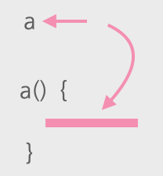

# 임시 변수를 질의 함수로 바꾸기 (Replace Temp with Query)

임시 변수를 값을 반환하는 질의 함수 호출로 대체하는 기법. 



## 🗣 설명

### 🧐 As is

```js
const basePrice = this._quantity * this._itemPrice;

if(basePrice < 1000)
	return basePrice * 0.95;
else
	return basePrice * 0.98;
```

### 😍 To be

```js
function basePrice() { this._quantity * this._itemPrice; } 

...

if(basePrice() > 1000)
	return this._basePrice * 0.95;
else
	return this.basePrice * 0.98;
```

### 📋 상세

긴 함수의 일부 로직을 별도의 함수로 분리할 때, 분리하려는 로직이 참고하는 지역 변수가 많으면 로직을 분리하기가 어렵다. 의존 관계가 생겨서 관계를 깔끔하게 정리하기가 어렵기 때문. 이 때 임시 변수를 질의 함수로 바꿔서 변수를 줄이면 훨씬 수월하게 리팩터링을 할 수 있다.

### ⚙️ 절차

1. 변수를 사용하기 전에 값을 결정하는지, 변수를 사용할 때마다 계산 로직이 매번 다른 값을 반환하는지 확인한다.
2. 읽기 전용으로 만들 수 있는 변수는 읽기 전용으로 만든다.
3. 테스트를 한다.
4. 변수 대입문을 함수로 추출한다.
5. 테스트를 한다.
6. 변수 인라인하기로 임시 변수를 제거한다.