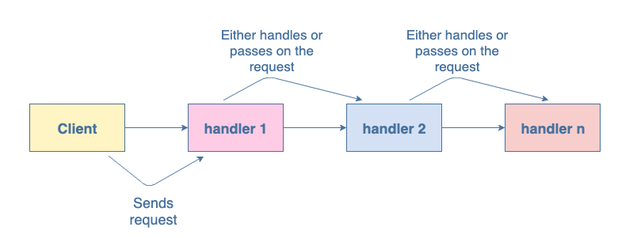

# 책임 연쇄(Chain of Responsibility)

## **💡 책에서 설명하는 의도**

요청에 대한 처리 기회를 체이닝 된 여러 객체에게 주어, 클라이언트와 처리하는 객체들 간의 결합도를 낮추기 위한 패턴

## **🧐 우리 상황에 맞게 풀어 쓴 동기**

서비스에서 던진 에러를 포매팅 한다고 할 때, 메쉬원에서 사용중인 api 서버들의 종류는 너무너무 다양합니다. 또한 던져진 에러메세지 종류도 다양합니다.



서비스에서 던져진 에러객체가 여러개의 핸들러 객체를 따라서 전달된다고 합시당. 각 핸들러는 자신의 도메인과 관련된 타입의 에러이면 핸들링하고, 아니라면 다음 핸들러에게 넘겨줍니다. 이렇게하면, 서비스에서는 몇개의 핸들러가 어떤 순서로 처리하는지 몰라도 메세지만 전달하면 됩니다. 각 핸들러들은 자기 도메인의 에러일때만 처리하고 아니라면 다음 핸들러에게 넘겨주기만 하면 됩니다. (또한 다음으로 넘겨줄 핸들러만 알고있으면 됩니다)

## **🛠 활용성: 이럴 때 씁니다**

- 여러 객체에게 처리하도록 하고 싶을 때, 그렇지만 그 순서나 첫번째 요청 객체를 모르게 하고 싶을 때
- 예를들면 DOM 이벤트 프로퍼게이션
  - DOM 트리에서 원하는 곳에서 이벤트를 핸들링하도록 할 수 있다.
- Express 서버나 Redux 등의 미들웨어

## **🎁 결과**

- 메세지 전달자 (sender)가 핸들러의 요청 처리 순서나 방법등을 몰라도 된다. ⇒ 각 클래스의 결합도가 낮아진다.
- 핸들러의 순서, 타입 등이 동적으로 결정될 수 있다.
- 다만 반드시 명시적으로 메세지 수신자를 결정하지 않기 때문에 항상 메세지가 처리된다고 보장할 수 없으며, 체인의 순서를 알기 어렵기때문에 디버깅이 어려울 수 있다.

## **🗺 구현 방법**

추상 Handler 클래스 → handleSomething, nextHandler

구체 Handler 클래스 → handleSomthing에서 실제 처리 로직을 구현, 처리할 방법이 없다면 다음 핸들러의 handleSomthineg을 호출

```tsx
class HandlerChain {
  setNextObj(nextObjInChain) {}
  processMultiple(req) {
    console.log("No multiple for: " + req.getMultiple());
  }
}

class Multiple {
  constructor(multiple) {
    this.multiple = multiple;
  }

  getMultiple() {
    return this.multiple;
  }
}

class MultipleofTwoHandler extends HandlerChain {
  constructor() {
    super();
    this.nextObjInChain = new HandlerChain();
  }

  setNextObj(nextObj) {
    this.nextObjInChain = nextObj;
  }

  processMultiple(req) {
    if (req.getMultiple() % 2 == 0) {
      console.log("Multiple of 2: " + req.getMultiple());
    } else {
      this.nextObjInChain.processMultiple(req);
    }
  }
}

class MultipleofThreeHandler extends HandlerChain {
  constructor() {
    super();
    this.nextObjInChain = new HandlerChain();
  }

  setNextObj(nextObj) {
    this.nextObjInChain = nextObj;
  }

  processMultiple(req) {
    if (req.getMultiple() % 3 == 0) {
      console.log("Multiple of 3: " + req.getMultiple());
    } else {
      this.nextObjInChain.processMultiple(req);
    }
  }
}

class MultipleofFiveHandler extends HandlerChain {
  constructor() {
    super();
    this.nextObjInChain = new HandlerChain();
  }

  setNextObj(nextObj) {
    this.nextObjInChain = nextObj;
  }

  processMultiple(req) {
    if (req.getMultiple() % 5 == 0) {
      console.log("Multiple of 5: " + req.getMultiple());
    } else {
      this.nextObjInChain.processMultiple(req);
    }
  }
}

//configuring the chain of handler objects
var c1 = new MultipleofTwoHandler();
var c2 = new MultipleofThreeHandler();
var c3 = new MultipleofFiveHandler();
c1.setNextObj(c2);
c2.setNextObj(c3);

//the chain handling different cases
c1.processMultiple(new Multiple(95));
c1.processMultiple(new Multiple(50));
c1.processMultiple(new Multiple(9));
c1.processMultiple(new Multiple(4));
c1.processMultiple(new Multiple(21));
c1.processMultiple(new Multiple(23));
```

handler들을 미리 상위 클래스에 등록하거나(이렇게 하면 다음 핸들러를 핸들러끼리 알 필요는 없지만 상위에서 관리되어야 한다) handler에 대한 setter 메소드를 작성해서 만드는 방법 등이 있다.

중요한것은 각 구현 핸들러들이 메세지 처리방법을 구현해야 하며, 다음 핸들러를 알고있어야 한다.

## **🔙 우리가 사용한 예시 (또는 우리가 사용했다면...)**

이미 framework레벨에서 많이 사용되고 있는 것이 있는데, 메쉬원에 적용한다면..

파일 처리 로직을 구성할 때 확장자별로 다른 핸들러를 달거나 엑셀 파일 처리를 할때도 각 처리 방법별로 핸들러를 나눠서 구성해도 괜찮을 듯 하다!
