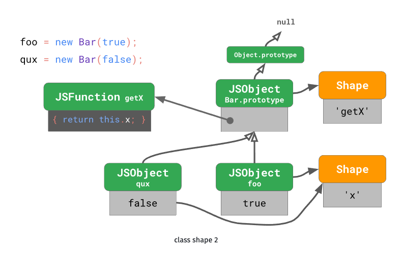
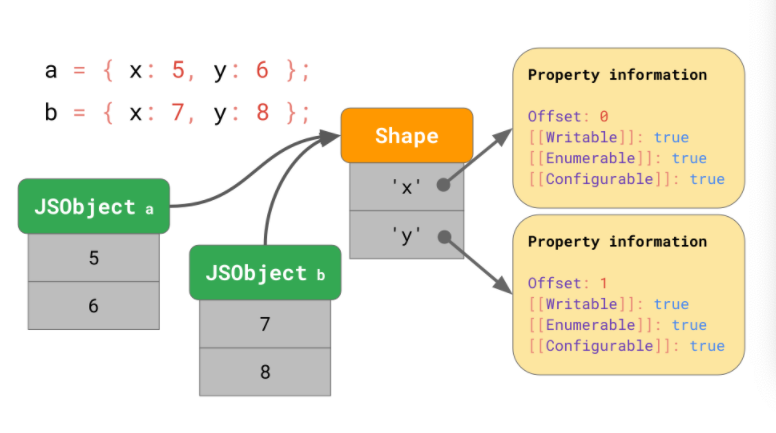
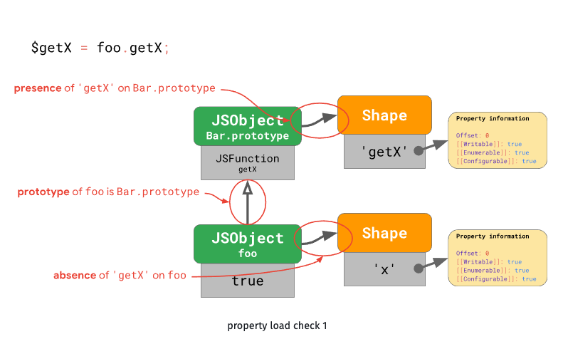
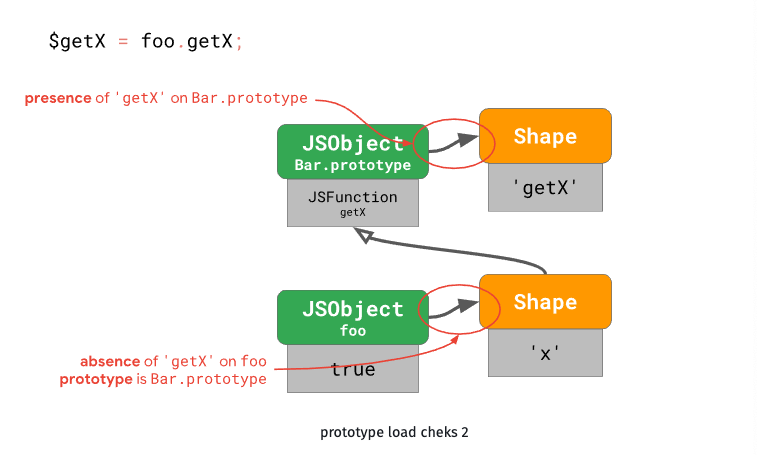
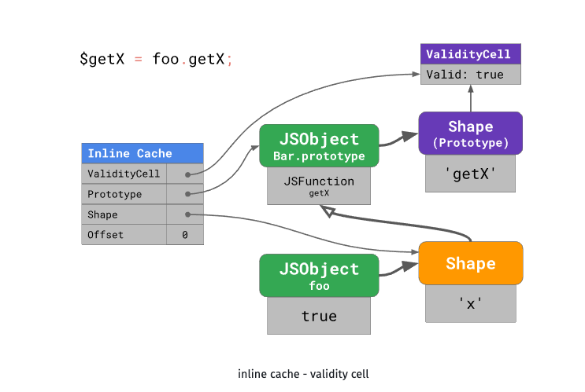

# 원형 (PROTOTYPE)

## 💡 책에서 설명하는 의도

"원형이 되는(Prototypical) 인스턴스를 사용하여 생성할 객체의 종류를 명시하고, 이렇게 만든 견본을 복사해서 새로운 객체를 생성합니다." (객체 생성 패턴)

## 🧐 우리 상황에 맞게 풀어 쓴 동기

- 사실 자바스크립트는 프로토타입 기반 언어라고 합니다..
- 비록 GoF의 프로토타입 패턴에서처럼 clone() 연산의 구현이 없고 언어 레벨에서 객체 생성시에 자동으로 프로토타입을 연결해주고 있어서 좀 다르긴 하지만, 객체 생성시에 원형에 대한 레퍼런스를 복사한다는 컨셉에서는 같다고 할 수 있습니다.
- 프로토타입을 통한 상속(위임)을 이용할 수 있는 경우는 주로 비슷한 기능을 가진 클래스(함수)가 많아 졌을 경우를 생각해 볼 수 있습니다. 예를들면, 메쉬원의 ListStore 클래스와 이 클래스를 상속하는 여러 Store 클래스들을 생각해보세요. 서로 비슷한 기능 (search, 등등...) 과 속성을 갖고 있으면서 특정 상태를 미리 ListStore에서 초기화 해주고 있어서 개별 스토어를 생성할 때 마다 초기화해주는 수고로움이 줄어듦니다. 또한 복제할 필요가 있는 데이터들을 미리 ListStore에 필요하다면 담아두고 이 원형을 복사해서 사용하면 됩니다.
- 모델 클래스를 기반으로 모델 인스턴스를 생성하는 경우에도 마찬가지로 볼 수 있습니다.

## 🛠 활용성: 이럴 때 씁니다

- 객체 생성에 비용이 많이 드는 경우

## 🎁 결과

- 메모리를 효율적으로 사용할 수 있다.
- 코드 재사용성이 높아진다.
- (사실 원형 패턴 자체가 동적이고 1급 객체를 다루는 언어에서는 이득이 별로 체감되지 않는 것 같습니다.)

## 🗺 구현 방법

- 책에 나온대로의 컨셉..

```tsx
/**
 * The example class that has cloning ability. We'll see how the values of field
 * with different types will be cloned.
 */
class Prototype {
  public primitive: any;
  public component: object;
  public circularReference: ComponentWithBackReference;

  public clone(): this {
    const clone = Object.create(this);

    clone.component = Object.create(this.component);

    // Cloning an object that has a nested object with backreference
    // requires special treatment. After the cloning is completed, the
    // nested object should point to the cloned object, instead of the
    // original object. Spread operator can be handy for this case.
    clone.circularReference = {
      ...this.circularReference,
      prototype: { ...this },
    };

    return clone;
  }
}

class ComponentWithBackReference {
  public prototype;

  constructor(prototype: Prototype) {
    this.prototype = prototype;
  }
}

/**
 * The client code.
 */
function clientCode() {
  const p1 = new Prototype();
  p1.primitive = 245;
  p1.component = new Date();
  p1.circularReference = new ComponentWithBackReference(p1);

  const p2 = p1.clone();
  if (p1.primitive === p2.primitive) {
    console.log(
      "Primitive field values have been carried over to a clone. Yay!"
    );
  } else {
    console.log("Primitive field values have not been copied. Booo!");
  }
  if (p1.component === p2.component) {
    console.log("Simple component has not been cloned. Booo!");
  } else {
    console.log("Simple component has been cloned. Yay!");
  }

  if (p1.circularReference === p2.circularReference) {
    console.log("Component with back reference has not been cloned. Booo!");
  } else {
    console.log("Component with back reference has been cloned. Yay!");
  }

  if (p1.circularReference.prototype === p2.circularReference.prototype) {
    console.log(
      "Component with back reference is linked to original object. Booo!"
    );
  } else {
    console.log("Component with back reference is linked to the clone. Yay!");
  }
}

clientCode();
```

- 하지만 이렇게 사용할 일이 없을 것 같습니다.
- 자바스크립트에서 프로토타입 체인을 연결하는 객체 생성

```jsx
// class 문법
class Bar {
  constructor(x) {
    this.x = x;
  }
  getX() {
    return this.x;
  }
}

// 생성자 함수
function Bar(x) {
  this.x = x;
}

Bar.prototype.getX = function getX() {
  return this.x;
};

// 이 둘은 같다.
```

- 이 코드를 실행했을 때,
  
  - 이렇게 인스턴스 객체에 대한 Shape와 프로토타입 객체를 공유합니다.

## 🔙 우리가 사용한 예시 (또는 우리가 사용했다면...)

- 모델 인스턴스 생성

참고

V8엔진에서 프로토타입 객체 접근시 최적화



- Shape는 객체의 property이름과 그 프로퍼티에 대한 정보를 value만 제외하고 저장합니다. 그리고 value에 대한 오프셋을 갖고있어서 객체에 저장된 밸류에 바로 접근합니다.



- 먼저 foo에서 getX가 있는지 체크합니다.
- 두번째로 Bar.prototype이 foo의 바로 상위 프로토타입이 맞는지 확인합니다.
- 세번째로 Bar.prototype에 getX가 있는지 체크합니다.
- 이런식으로 총 3번의 체크가 필요합니다. (1 + 2N) N은 프로토타입의 갯수
- 속도 최적화를 위해 V8엔진에서는 프로토타입 체크하는 횟수를 줄이기로 합니다.



- Shape



- 각 프로토타입에 대한 Shape를 두고, prototype객체가 변하지 않았다면 validityCell의 valid 속성은 true로 유지됩니다.
- 인라인 캐시에서는 해당 프로퍼티가 발견된 프로토타입과
- 두번째 조회시에 인라인캐시를 hit하면 엔진에서는 인스턴스의 shape와 validity cell을 체크하고 valid 하다면 엔진은 기억하고 있는 프로토타입의 offset으로 직접 접근해서 추가 조회를 생략합니다.
- 이렇게 하는 경우 속도가 좀 더 최적화됩니다.
