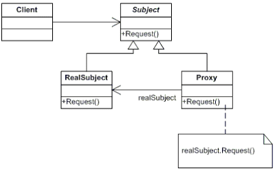

# Proxy

a.k.a. **대리자(Surrogate)**

## **💡 책에서 설명하는 의도**

다른 객체에 대한 접근을 제어하기 위한 대리자(surrogate) 또는 자리채움자(placeholder) 역할을 하는 객체를 둡니다.

## **🧐 우리 상황에 맞게 풀어 쓴 동기**

예를 들어 지도 위에 수천 개의 마커를 표시해야 한다고 생각해봅시다. 그리고 마커를 그리는 과정은 복잡해서 많은 자원을 필요로 한다고 가정하겠습니다. 

그런데 사용자는 내부적인 사정은 모르며, 지도 어플리케이션이 빠르게 동작하길 기대합니다. 그리고 사용자가 지도를 확대했다면 수천개의 마커를 한번에 그리지 않아도 됩니다.

이렇게 생성하거나 관리하기가 까다로운 객체로 인해, 꼭 필요할 때만 이 객체를 생성하는 방법이 필요하게 되었습니다. 중요한 것은 이미지가 필요할 때만 생성된다는 사실이 외부에 드러내선 안됩니다. 그리고 지도 어플리케이션의 관점에서 구현을 복잡하게 만들어서도 안됩니다. 

해결책은 마커의 대역을 맡은 **마커** **프록시**라는 객체를 생성하는 것입니다. **마커 프록시**는 마커처럼 동작하고, 필요할 때 마커의 인스턴스를 만들어냅니다.



Proxy는 RealSubject처럼 행동하며 필요할 때 RealSubject의 인스턴스를 만듭니다.

## **🛠 활용성: 이럴 때 씁니다**

- 원격지 프록시(remote proxy): 서로 다른 주소 공간에 존재하는 객체를 가리키는 대표 객체로, 로컬 환경에 위치합니다.
- 가상 프록시(virtual proxy): 요청이 있을 때만 필요한 고비용 객체를 생성합니다. (**동기에서 설명한 예시에 해당합니다.)**
- 보호용 프록시(protection proxy): 원래 객체에 대한 실제 접근을 제어합니다. 이는 객체별로 접근 제어 권한이 다를 때 유용하게 사용할 수 있습니다.
- 스마트 참조자(smart reference): 원시 포인터의 대체용 객체로, 실제 객체에 접근이 일어날 때 추가적인 행동을 수행합니다. 사용예는 다음과 같습니다.
    1. 실제 객체에 대한 참조 횟수를 저장하다가 더는 참조가 없을 때 해당 객체를 자동으로 없앱니다. (aka. 스마트 포인터)
    2. 맨 처음 참조되는 시점에 영속적 저장소의 객체를 메모리로 옮깁니다.
    3. 실제 객체에 접근하기 전에, 다른 객체가 그것을 변경하지 못하도록 실제 객체에 잠금을 겁니다.

## **🎁 결과**

프록시 패턴은 어떤 객체에 접근할 때 추가적인 **간접화 통로**를 제공합니다. 이렇게 추가된 간접화 통로는 **프록시의 종류에 따라**서 여러 가지 쓰임새가 있습니다.

1. 원격지 프록시는 객체가 다른 주소 공간에 존재한다는 사실을 숨길 수 있습니다.
2. 가상 프록시는 요구에 따라 객처를 생성하는 등 처리를 할 수 있습니다.
3. 보호용 프록시 및 스마트 참조자는 객체가 접근할 때마다 추가 관리를 책임집니다. 객체를 생성할 것인지 삭제할 것인지를 관리합니다.

## **🗺 구현 방법**

동기에서 예시로 든 지도 위의 마커를 그리는 케이스를 프록시로 구현해보려고 합니다.

우선 지도 상의 그래픽 객체를 나타내는 `Graphic` 클래스를 작성합니다.

```tsx
abstract class Graphic {
	abstarct public draw(latLng: LatLng): void;
}
```

다음으로 `Graphic` 를 구현하는 `Marker` 클래스를 작성합니다.

```tsx
class Marker extends Graphic {
	constructor(id: string) { 
		// id를 기반으로 마커를 생성합니다.
	}

	public draw(latLng: LatLng) { 
		// 인자로 전달된 좌표에 마커를 그립니다.
	}
}
```

`MarkerProxy` 클래스도 역시 `Graphic` 를 구현하여 작성합니다. `MarkerProxy` 는 `Marker` 객체에 대한 정보를 멤버 변수로 갖고 있습니다. 그리고 `Marker` 객체가 이미 생성되었다면 그것을 반환하고, 아니라면 새로 생성한 후 반환할 수 있게 `getMarker` 메서드도 작성합니다.

```tsx
class MarkerProxy extends Graphic {
	private id: string;
	private marker: Marker;

	constructor(id: string) { this.id = id; }

	public getMarker() {
		if (!this.marker) {
			this.marker = new Marker(this.id);
		}

		return this.marker;
	}

	public draw(latLng: LatLng) {
		this.getMarker().draw(latLng);
	}
}
```

`Graphic`, `MarkerProxy` , `Marker`는 `Map` 클래스에서 사용한다고 가정하겠습니다. 이제 클라이언트 코드에 해당하는 `Map` 클래스를 작성합니다.

```tsx
class MeshMap {
	private markers: Graphic[] = [];

	public insert(graphic: Graphic) {
		// 그래픽 요소를 지도에 추가합니다.
		this.markers.push(graphic)
	}

	public changeZoom() {
		// 만약 zoom이 변경되면 지도에 추가되었던 그래픽 요소의 draw를 호출합니다.
		/**
		 * this.markers.forEach(m => m.draw(latLng));
		 */
	}
}

const map = new MeshMap();
map.insert(new MarkerProxy("첫 번째 마커"));
```

## **🔙 우리가 사용한 예시 (또는 우리가 사용했다면...)**

ES6에서 소개된 자바스크립트의 Proxy는 이름만 봐도 알겠지만, 프록시 패턴과 관련되어 있습니다. 자바스크립트의 Proxy 객체를 사용하면 프록시 객체를 쉽게 만들 수 있습니다.

### 프록시 패턴으로 해결할 수 있는 문제

- 객체에 대한 접근을 제어**(보호용 프록시)**
- 객체에 대한 접근이 일어나면 추가적인 동작을 수행**(스마트 참조자)**
- ... 등등

### 자바스크립트의 Proxy

- 타겟 객체(원본 객체)에 대한 접근을 가로채고, 추가적인 동작을 수행할 수 있게 합니다.
- MobX에서는 자바스크립트의 Proxy를 사용하여 구현된 기능들이 있습니다. (ex. observable)

## 참고

- [Proxy Wikipedia](https://en.wikipedia.org/wiki/Proxy_pattern)
- [MDN Proxy](https://developer.mozilla.org/ko/docs/Web/JavaScript/Reference/Global_Objects/Proxy)
- [The Amazing Power of JavaScript Proxies](https://levelup.gitconnected.com/the-amazing-power-of-javascript-proxies-aa27c6d06bcb)