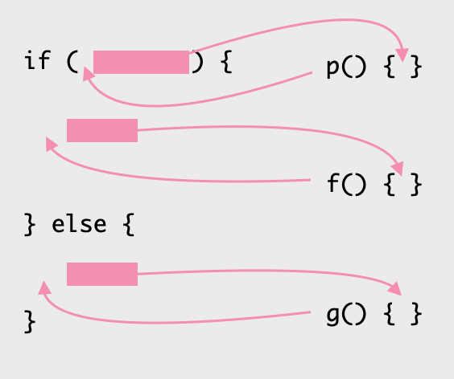

# 10.1 조건문 분해하기(Decompose Conditional)

복잡한 조건부 로직을 부위별로 분해하여 의미를 드러내는 함수 호출로 대체하는 기법.



## 🗣 설명

### 🧐 As is

```jsx
let charge;

if (!aDate.isBefore(plan.summerStart) && !aDate.isAfter(plan.summerEnd))
	charge = quantity * plan.summerRate;
else
	charge = quantity * plan.regularRate + planRegularSeviceCharge;

return charge;
```

### 😍 To be

```jsx
if (isSummerPlan(plan))
	return summerCharge();
else
	return regularCharge();
```

### 📋 상세

복잡한 조건부 로직은 프로그램을 복잡하게 만드는 원흉임. 다양한 조건에 따른 동작을 하나의 함수에서 모두 처리하는 함수는 길어지기 쉬움. 이런 경우 각 조건절의 코드만 봐서는 왜 이런 처리를 해야하는지 이해하기 어려워짐.

예를 들어 아래의 코드는 if 조건의 의미를 단번에 이해하기 어려움. if 조건을 만족할 때 수행하는 로직도 어떤 의미를 담고 있는지 코드를 곱씹어봐야만 이해할 수가 있음.

```jsx
if (!aDate.isBefore(plan.summerStart) && !aDate.isAfter(plan.summerEnd))
	charge = quantity * plan.summerRate;
```

조건문 분해하기를 적용한 아래의 코드는, 우리가 훨씬 쉽게 의도를 읽을 수 있음.

```jsx
if (isSummerPlan(plan))
	return summerCharge();
```

### ⚙️ 절차

1. 조건식과 그 조건식에 딸린 조건절 각각을 함수로 추출한다.
2. 테스트한다.