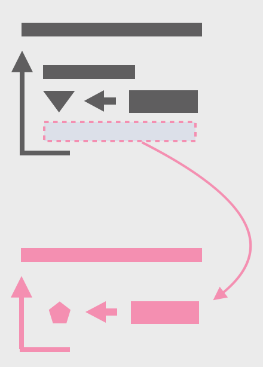

# 8.7 반복문 쪼개기(Split Loop)

두 가지 이상의 일을 수행하는 반복문을 각각의 반복문으로 분리하는 기법.



## 🗣 설명

### 🧐 As is

```jsx
let averageAge = 0;
let totalSalary = 0;
for (const p of people) {
	averageAge += p.age;
	totalSalary += p.salary;
}
averageAge = averageAge / people.length
```

### 😍 To be

```jsx
let totalSalary = 0;
for (const p of people) {
	totalSalary += p.salary;
}

let averageAge = 0;
for (const p of people) {
	averageAge += p.age;
}
averageAge = averageAge / people.length
```

### 📋 상세

하나의 반복문 안에서 여러 가지 일을 처리하는 경우에 아래의 문제가 발생할 수 있음. 반복문 쪼개기는 이 문제를 해결할 때 사용하는 기법. 

- 반복문을 수정해야 할 때마다, 반복문 안에서 일어나는 모든 일을 이해해야 한다.
- 서로 다른 일이 하나의 함수 안에서 이뤄지고 있다는 신호일 수 있다.
- 반복문 안에서 구조체나 지역 변수를 사용하고 있을 가능성이 높고, 이 경우 리팩터링을 하기 어려워진다.

성능에 문제는 없을까? 반복을 여러 번 수행하면 당연히 성능은 떨어진다. 하지만 성능이 큰 병목이 되지 않는 상황이라면, 성능 보다는 오히려 코드를 변경하기 쉬운 구조로 만드는 게 더 이득이 크다.

### ⚙️ 절차

1. 반복문을 복사한다.
2. 하나의 반복문이 하나의 관심사를 처리하도록 수정한다.
3. 테스트한다.
4. 각 반복문을 함수로 추출할지 검토한다.