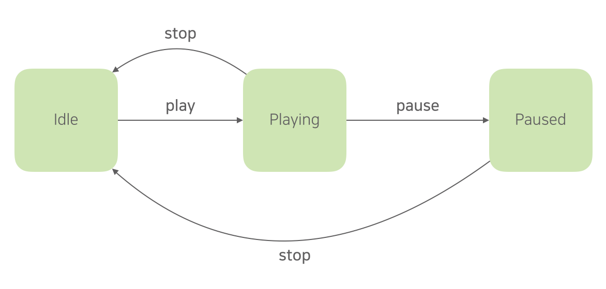
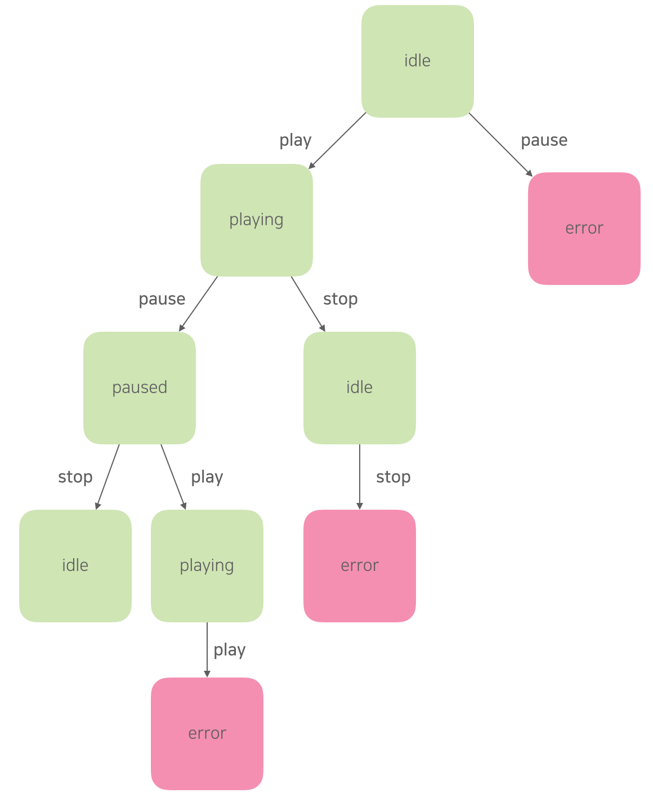

# 테스트 케이스 설계 기법을 알아두면 좋아요.

테스트 코드를 리뷰하다보면 아래와 같은 명세를 마주칠 때가 자주 있습니다.

>  문자열을 입력하면 적절한 값을 반환해야 한다.

모든 “문자열”을 입력해도 되는 걸까요? “적절한 값”이란 무엇일까요? 만약 “문자열에 숫자를 포함시킬 수 없다."라는 요구 사항이 있다면 어떨까요? 명세가 모호해서 코드를 읽어야만 테스트에 담긴 의도를 읽을 수 있습니다.

하지만 아래의 테스트는 코드를 봐도 올바른 입력이고, 무엇이 올바른 결과인지 이해하기 어렵습니다. 테스트 명세에 모호한 단어가 보인다면 한 번쯤 의심해보는 게 좋습니다.

```javascript
it("문자열을 입력하면 적절한 값을 반환해야 한다.", () => {
  // given
  const oldStr = "hello world";

  // when
  const newStr = removeSpace(oldStr);

  // then
  expect(newStr).toBe("helloworld");
});
```

그리고 이 테스트 케이스 만으로는 removeSpace를 충분히 검증할 수 없습니다. 

좋은 테스트를 작성하려면 먼저 요구 사항을 제대로 식별해야 합니다. 식별한 요구 사항을 바탕으로 테스트 케이스를 충분히 만들어야 합니다. 즉, 테스트 케이스를 잘 설계해야 합니다.

테스트 기법 중에 블랙박스 테스트라는 게 있습니다. 블랙박스 테스트는 세부 구현은 무시하고 입력 값에 대한 결과만 확인하는 테스트 기법입니다. 구현이 아닌 인터페이스를 테스트한다는 점에서 개발자 테스트가 지향해야 하는 바와 잘 맞습니다.

이 글에서는 블랙박스 테스트를 설계하는 기법 중에서 제가 가장 쉽다고 생각하는 4가지를 간단히 살펴봅니다.

1. 동등 분할
2. 경계값 분석
3. 결정 테이블
4. 상태 전이


## 1. 동등 분할

동일한 결과를 만들 것으로 예상되는 입력 값의 범위를 정한 다음에 각 범위를 대표하는 값을 선택하는 방식입니다. 예를 들어 점수 범위에 따라 성적 등급을 반환하는 함수가 있을 때, 각 점수 범위의 대푯값을 선택하여 테스트 케이스를 정의하는 방식입니다.

| 점수 범위 | 대표 값 | 성적 |
| --------- | ------- | ---- |
| 100 - 91  | 95      | 수   |
| 90 - 81   | 83      | 우   |
| 80 - 71   | 72      | 미   |
| 70 - 61   | 68      | 양   |
| 60 - 0    | 12      | 가   |

이 테이블을 테스트 코드로 이렇게 옮길 수 있습니다.

```javascript
describe("성적 판단", () => {
  it("점수가 95점이면 성적은 '수'여야 한다.", () => {
    // given
    const score = 95;
    // when
    const grade = decideGrade(score);

    // then
    expect(grade).toBe("수");
  });

  it("점수가 83점이면 성적은 '우'여야 한다.", () => {
    // given
    const score = 95;
    // when
    const grade = decideGrade(score);

    // then
    expect(grade).toBe("수");
  });

  it("점수가 72점이면 성적은 '미'여야 한다.", () => {
    // given
    const score = 95;
    // when
    const grade = decideGrade(score);

    // then
    expect(grade).toBe("수");
  });

  it("점수가 68점이면 성적은 '양'여야 한다.", () => {
    // given
    const score = 95;
    // when
    const grade = decideGrade(score);

    // then
    expect(grade).toBe("수");
  });

  it("점수가 12점이면 성적은 '가'여야 한다.", () => {
    // given
    const score = 95;
    // when
    const grade = decideGrade(score);

    // then
    expect(grade).toBe("수");
  });
});
```

## 2. 경계값 분석

동등 분할은 대푯값을 추출함으로써 테스트 비용을 줄일 수 있다는 게 장점입니다. 하지만 입력 범위의 극단(Edge)에서 발생하는 오류를 검증하지 못합니다. 

경계값 분석은 대푯값의 범위를 값의 경계 범위까지 확장하여 이 문제를 해결합니다. 대신에 테스트 케이스를 조금 더 많이 만들어야 합니다. 하지만 에러는 놓치기 쉬운, 눈에 잘 띄지 않는 지점에서 많이 발생한다는 점을 생각해보면, 충분히 투자할만한 비용입니다.

| 점수 범위 | 경계 값 | 기대 결과 |
| --------- | ------- | --------- |
| 100 - 91  | 101     | Error     |
|           | 100     | 수        |
|           | 91      | 수        |
| 90 - 81   | 90      | 우        |
|           | 81      | 우        |
| 80 - 71   | 80      | 미        |
|           | 71      | 미        |
| 70 - 61   | 70      | 양        |
|           | 61      | 양        |
| 60 - 0    | 60      | 가        |
|           | 0       | 가        |
|           | -1      | Error     |

```javascript
describe("성적 판단", () => {
  it("점수가 101점이면 Error를 반환해야 한다.", () => {
    // given
    const score = 100;
    // when
    // then
    expect(decideGrade(score)).toThrow(InvalidValueError);
  });

  it("점수가 100점이면 성적은 '수'여야 한다.", () => {
    // given
    const score = 100;
    // when
    const grade = decideGrade(score);

    // then
    expect(grade).toBe("수");
  });

  it("점수가 91점이면 성적은 '수'여야 한다.", () => {
    // given
    const score = 91;
    // when
    const grade = decideGrade(score);

    // then
    expect(grade).toBe("수");
  });

  .
  .
  .
  
});
```

## 3. 결정 테이블

입력과 값을 연결하는 조건이 여러 경우의 수를 고려해야 한다면 의사결정 테이블을 이용할 수 있습니다. 예를 들어, 9급 공무원 시험의 합격 기준이 아래와 같다고 가정합시다.

- 행정학개론, 행정법, 영어, 국어, 국사 평균 80점 이상
- 20점 이하인 과목이 있으면 무조건 탈락

조건을 조합하는 이런 테이블을 만들어서 테스트 케이스를 도출하는 방식입니다.

|        | 행정학개론 | 행정법 | 영어 | 국어 | 국사 | 평균 | 결과 |
| ------ | ---------- | ------ | ---- | ---- | ---- | ---- | ---- |
| 김코딩 | 80         | 80     | 80   | 80   | 80   | 80   | 합격 |
| 김따뜻 | 81         | 79     | 81   | 79   | 79   | 79.8 | 탈락 |
| 김냉정 | 100        | 100    | 100  | 100  | 20   | 84   | 탈락 |

이 방법을 이용하면 테스트 케이스를 작성하는 과정에서 요구 사항의 문제를 효과적으로 식별할 수 있습니다. 하지만 작성하는 데에 많은 비용을 써야 합니다. 또한 복잡한 조건과 시스템을 표현하기가 어렵습니다.

```javascript
describe("합격 판단", () => {
  it("평균이 80이고 과락이 없다면 합격이어야 한다.", () => {
    // given
    const report = {
      "행정학개론": 80,
      "행정법": 80,
      "영어": 80,
      "국어": 80,
      "국사": 80,
    };
    // when
    const passed = checkIfPass(report);

    // then
    expect(passed).toBeTruthy();
  });

  it("평균이 79.8이면 과락이 없더라도 불합격이어야 한다.", () => {
    // given
    const report = {
      "행정학개론": 81,
      "행정법": 79,
      "영어": 81,
      "국어": 79,
      "국사": 79,
    };
    // when
    const passed = checkIfPass(report);

    // then
    expect(passed).toBeFalsy();
  });

  it("평균이 84지만 국사가 20점이라면, 과락으로 불합격이어야 한다.", () => {
    // given
    const report = {
      "행정학개론": 100,
      "행정법": 100,
      "영어": 100,
      "국어": 100,
      "국사": 20,
    };
    // when
    const passed = checkIfPass(report);

    // then
    expect(passed).toBeFalsy();
  });

  .
  .
  .
  
});
```

## 4. 상태 전이

시스템이 1) 상태를 갖고, 2) 한 상태에서 다른 상태로 바뀔 수 있으며, 3) 상태에 따라 다르게 동작하는 경우에 상태가 바뀌는 흐름을 트리로 만들어서 테스트 케이스를 도출하는 방법입니다.

아래와 같은 상태를 가진 너무나 평범한 동영상 플레이어가 있다고 가정합시다.



상태 전이 과정을 트리로 그려봅니다. 트리를 만들 때 예외 케이스도 고려하는 게 좋습니다.



최상위 노드에서 자식 노드까지 이어지는 상태 전이 과정을 개별 테스트 케이스로 추출합니다. 전이 과정을 하나를 한 개의 케이스로 추출하세요. 그래야 케이스가 단순해집니다.

| 케이스 | 현재 상태 | 입력  | 기대 결과 |
| ------ | --------- | ----- | --------- |
| 1-1    | idle      | play  | playing   |
|        | playing   | pause | paused    |
|        | paused    | stop  | idle      |
|        | idle      | stop  | error     |
| 1-2    | paused    | play  | playing   |
|        | playing   | play  | error     |
| 1-3    | playing   | stop  | idle      |
|        | idle      | stop  | error     |
| 1-4    | idle      | pause | error     |

이 테이블을 테스트 케이스로 옮기면 되겠죠.

```javascript
describe("멈춤일 때", () => {
  let player;

  beforeEach(() => {
    player = new VideoPlayer({ status: "idle" });
  });

  it("재생을 하면 재생중(playing) 상태가 되어야 한다.", () => {
    // given
    // when
    player.play();

    // then
    expect(player.status).toBe("playing");
  });

  it("재생을 했다가 일시 정지를 하면 일시정지(paused) 상태가 되어야 한다.", () => {
    // given
    player.play();

    // when
    player.pause();

    // then
    expect(player.status).toBe("paused");
  });

  it("일시 정지를 한 후에 멈춤을 누르면 유휴(idle) 상태가 되어야 한다.", () => {
    // given
    player.pause();

    // when
    player.stop();

    // then
    expect(player.status).toBe("idle");
  });

  .
  .
  .
  
});
```